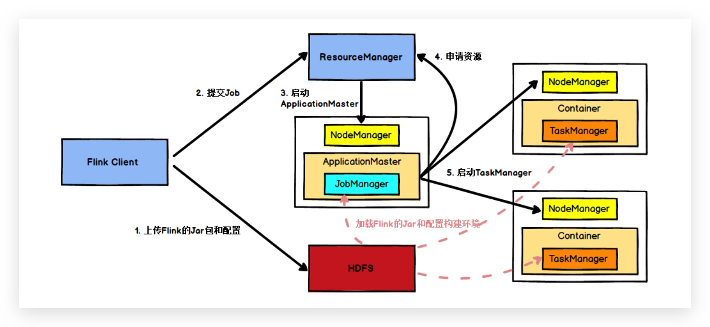
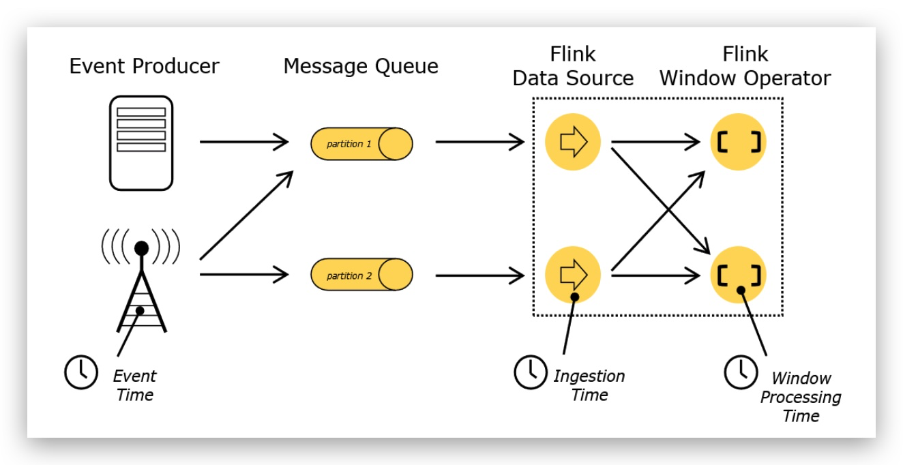

# Overview

> 实现Google Dataflow流式计算模型实现了高吞吐,低延迟,高性能
>
> 高度容错的状态管理,防止在计算过程中因为系统异常而出现丢失,flink周期性地通过分布式快照技术Checkpoint实现状态的持久化维护,即使停机或者异常的情况下都能计算出正确的结果

# Feature

* Flink同时支持高吞吐,低延迟,高性能(spark高吞吐,高性能.storm低延迟,高性能)
* 支持事件时间EventTime
* 支持有状态计算
* 支持高度灵活的窗口Window操作:Time,Count,Session,Data-driven
* 基于轻量级分布式快照Snapshot实现的容错
* 基于JVM实现独立的内存管理
* Save Point(保存点)


**无界数据流**：无界数据流有一个开始但是没有结束

**有界数据流**：有界数据流有明确定义的开始和结束


# Flink运行架构

任务提交流程（yarn模式)




# **Flink** 流处理Api

> Envrioment —> Source —> Transform —> Sink


## Environment

* getExecutionEnvironment:创建
* createLocalEnvironment:本地
* createRemoteEnvironment:远程


## Source

* Kafka


## Transform

* map
* flatMap
* filter
* keyBy
* split
* select
* connect
* coMap
* union


## Sink

* Kafka
* Redis
* ElasticSearch
* JDBC


# Time与Window

## Time



* **Event Time**：是事件创建的时间。它通常由事件中的时间戳描述，例如采集的日志数据中，每一条日志都会记录自己的生成时间，Flink通过时间戳分配器访问事件时间戳。

* **Ingestion Time**：是数据进入Flink的时间。

* **Processing Time**：是每一个执行基于时间操作的算子的本地系统时间，与机器相关，默认的时间属性就是Processing Time。


## Window

Window可以分成两类

* CountWindow：按照指定的数据条数生成一个Window，与时间无关。

* TimeWindow：按照时间生成Window。

可以根据窗口实现原理的不同分成三类：

* 滚动窗口（Tumbling Window）
* 滑动窗口（Sliding Window）
* 会话窗口（Session Window）


## Window API

TimeWindow

* 滚动窗口
* 滑动窗口

CountWindow

* 滚动窗口
* 滑动窗口


# EventTime与Window

Watermark

> 乱序问题: 所谓乱序，就是指Flink接收到的事件的先后顺序不是严格按照事件的Event Time顺序排列的
>
> Watermark是一种衡量Event Time进展的机制，它是数据本身的一个隐藏属性，数据本身携带着对应的Watermark
>
> 通常用Watermark机制结合window来实现


## EvnetTimeWindow API

### 滚动窗口TumblingEventTimeWindows

```scala
def main(args: Array[String]): Unit = {
    //  环境
    val env: StreamExecutionEnvironment = StreamExecutionEnvironment.getExecutionEnvironment

    env.setStreamTimeCharacteristic(TimeCharacteristic.EventTime)
    env.setParallelism(1)

    val dstream: DataStream[String] = env.socketTextStream("hadoop1",7777)

    val textWithTsDstream: DataStream[(String, Long, Int)] = dstream.map { text =>
      val arr: Array[String] = text.split(" ")
      (arr(0), arr(1).toLong, 1)
    }
    val textWithEventTimeDstream: DataStream[(String, Long, Int)] = textWithTsDstream.assignTimestampsAndWatermarks(new BoundedOutOfOrdernessTimestampExtractor[(String, Long, Int)](Time.milliseconds(1000)) {
      override def extractTimestamp(element: (String, Long, Int)): Long = {

       return  element._2
      }
    })

    val textKeyStream: KeyedStream[(String, Long, Int), Tuple] = textWithEventTimeDstream.keyBy(0)
    textKeyStream.print("textkey:")

    val windowStream: WindowedStream[(String, Long, Int), Tuple, TimeWindow] = textKeyStream.window(TumblingEventTimeWindows.of(Time.seconds(2)))

    val groupDstream: DataStream[mutable.HashSet[Long]] = windowStream.fold(new mutable.HashSet[Long]()) { case (set, (key, ts, count)) =>
      set += ts
    }

    groupDstream.print("window::::").setParallelism(1)
    env.execute()
  }
}
```


### 滑动窗口SlidingEventTimeWindows

```scala
def main(args: Array[String]): Unit = {
  //  环境
  val env: StreamExecutionEnvironment = StreamExecutionEnvironment.getExecutionEnvironment

  env.setStreamTimeCharacteristic(TimeCharacteristic.EventTime)
  env.setParallelism(1)

  val dstream: DataStream[String] = env.socketTextStream("hadoop1",7777)

  val textWithTsDstream: DataStream[(String, Long, Int)] = dstream.map { text =>
    val arr: Array[String] = text.split(" ")
    (arr(0), arr(1).toLong, 1)
  }
  val textWithEventTimeDstream: DataStream[(String, Long, Int)] = textWithTsDstream.assignTimestampsAndWatermarks(new BoundedOutOfOrdernessTimestampExtractor[(String, Long, Int)](Time.milliseconds(1000)) {
    override def extractTimestamp(element: (String, Long, Int)): Long = {
     return  element._2
    }
  })

  val textKeyStream: KeyedStream[(String, Long, Int), Tuple] = textWithEventTimeDstream.keyBy(0)
  textKeyStream.print("textkey:")

  val windowStream: WindowedStream[(String, Long, Int), Tuple, TimeWindow] = textKeyStream.window(SlidingEventTimeWindows.of(Time.seconds(2),Time.milliseconds(500)))

  val groupDstream: DataStream[mutable.HashSet[Long]] = windowStream.fold(new mutable.HashSet[Long]()) { case (set, (key, ts, count)) =>
    set += ts
  }

  groupDstream.print("window::::").setParallelism(1)
  env.execute()
}
```


### 会话窗口EventTimeSessionWindows

```scala
def main(args: Array[String]): Unit = {
    //  环境
    val env: StreamExecutionEnvironment = StreamExecutionEnvironment.getExecutionEnvironment

    env.setStreamTimeCharacteristic(TimeCharacteristic.EventTime)
    env.setParallelism(1)

    val dstream: DataStream[String] = env.socketTextStream("hadoop1",7777)


    val textWithTsDstream: DataStream[(String, Long, Int)] = dstream.map { text =>
      val arr: Array[String] = text.split(" ")
      (arr(0), arr(1).toLong, 1)
    }
    val textWithEventTimeDstream: DataStream[(String, Long, Int)] = textWithTsDstream.assignTimestampsAndWatermarks(new BoundedOutOfOrdernessTimestampExtractor[(String, Long, Int)](Time.milliseconds(1000)) {
      override def extractTimestamp(element: (String, Long, Int)): Long = {

       return  element._2
      }
    })

    val textKeyStream: KeyedStream[(String, Long, Int), Tuple] = textWithEventTimeDstream.keyBy(0)
    textKeyStream.print("textkey:")

    val windowStream: WindowedStream[(String, Long, Int), Tuple, TimeWindow] = textKeyStream.window(EventTimeSessionWindows.withGap(Time.milliseconds(500)) )


    windowStream.reduce((text1,text2)=>
      (  text1._1,0L,text1._3+text2._3)
    )  .map(_._3).print("windows:::").setParallelism(1)

    env.execute()
  }
```


# Table API 与SQL

able API是流处理和批处理通用的关系型API，Table API可以基于流输入或者批输入来运行而不需要进行任何修改。Table API是SQL语言的超集并专门为Apache Flink设计的，Table API是Scala 和Java语言集成式的API。与常规SQL语言中将查询指定为字符串不同，Table API查询是以Java或Scala中的语言嵌入样式来定义的，具有IDE支持如:自动完成和语法检测