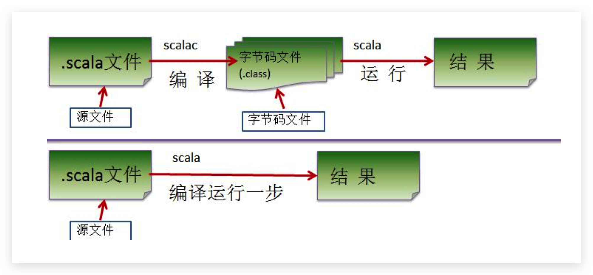
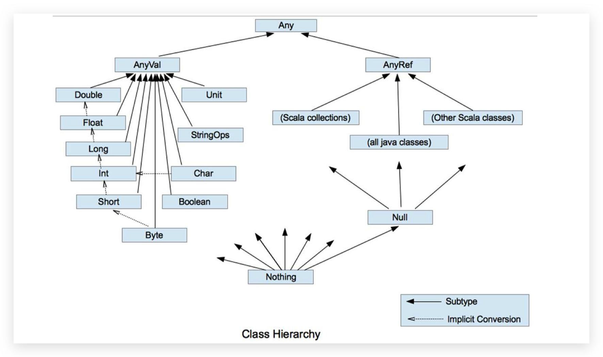
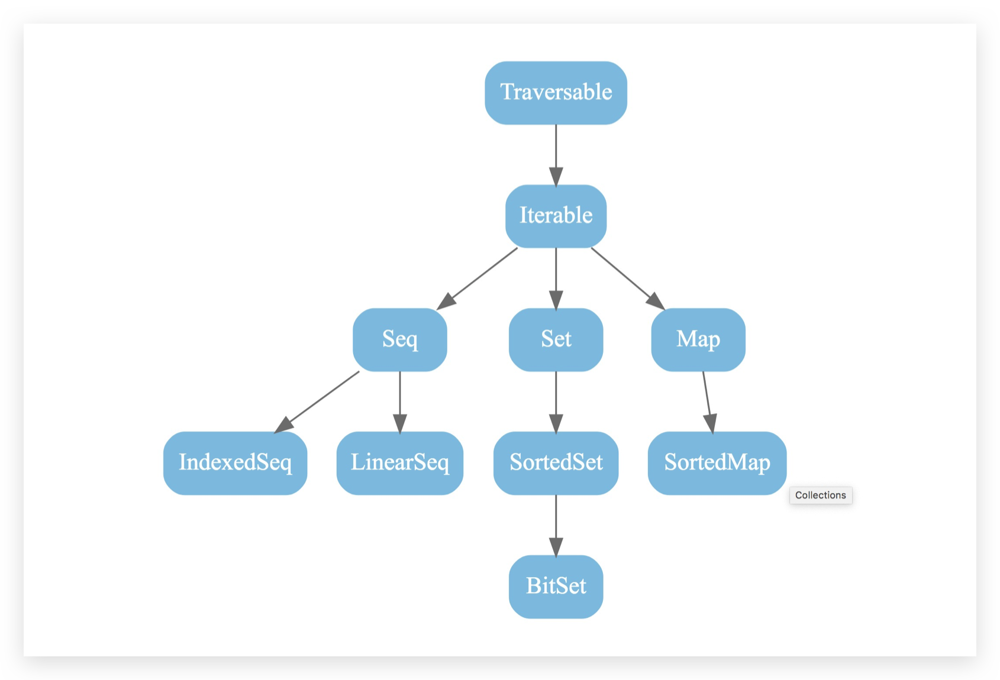
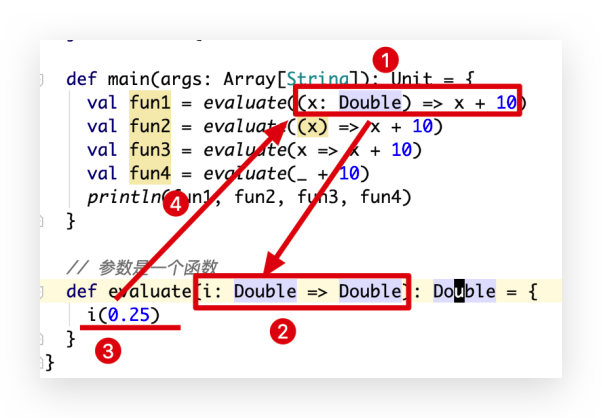

## Overview

> Scala combines object-oriented and functional programming in one concise, high-level language. Scala's **static types** help avoid bugs in complex applications, and its JVM and JavaScript runtimes let you build high-performance systems with easy access to huge ecosystems of libraries.	

[https://www.scala-lang.org](https://www.scala-lang.org/)

Scala 是一门以 java 虚拟机（JVM）为运行环境并将**面向对象**和**函数式编程**的最佳特性结合在一起 的**静态类型**编程语言

## 安装Install(Mac)

```shell
> brew install java 	# java > 1.8
> brew install scala
> brew info scala
> echo $SCALA_HOME
/usr/local/Cellar/scala/2.12.8
> scala
Welcome to Scala 2.12.8 (Java HotSpot(TM) 64-Bit Server VM, Java 1.8.0_191).
Type in expressions for evaluation. Or try :help.

scala> val a = 100
a: Int = 100

scala>
```


## Idea配置

* install plugin:settings>plugin>search scala
* Add framework support:项目右键
* add scala folder under main, apple scala to sources
* 关联源码

> Homebrew没有下载源码,下载相同版本源码https://github.com/scala/scala/archive/v2.12.8.tar.gz,放到相应位置/usr/local/Cellar/scala/2.12.8/**src**


## HelloWord

```scala
object Hello {

  def main(args: Array[String]): Unit = {
    System.out.println("hello world")
    println("Hello World")
  }
}
```

反编译

```java
public final class Hello{
  public static void main(String[] paramArrayOfString){
    Hello..MODULE$.main(paramArrayOfString);
  }
}

public final class Hello${
  public static  MODULE$;
  
  static{
    new ();
  }
  
  public void main(String[] args){
    System.out.println("hello world");
    Predef..MODULE$.println("hehe");
    int a = 100;
    Predef..MODULE$.println(BoxesRunTime.boxToInteger(a));
  }
  
  private Hello$(){
    MODULE$ = this;
  }
}
```


## Scala代码 执行流程



## 打印Print

```scala
object PrintDemo {

  def main(args: Array[String]): Unit = {
    //使用+ 
    var name: String = "tom"
    var sal: Double = 1.2
    println("hello" + sal + name)

    //使用格式化的方式 printf 
    printf("name=%s sal=%f\n", name, sal) 
    
    //使用$引用的方式，输出变量，类似 php 
    println(s"第三种方式 name=$name sal = ${sal + 1}")
  }
}
```

## 变量Variable

语法:var|val 变量名 [: 变量类型] = 变量值

```scala
var a : Int = 1
```

> var 修饰的变量可改变， val 修饰的 变量不可改(**加final**)
>
> 因为 val 没有线程安全问题，因此效率高，scala 的设计者推荐我们 val


## 数据类型

* Scala 与 Java 有着相同的数据类型，在 Scala 中数据类型都是对象
* Scala 数据类型分为两大类 AnyVal(值类型) 和 AnyRef(引用类型)



1. 在 scala 中有一个根类型 Any ,他是所有类的父类.
2. scala 中一切皆为对象，分为两大类 AnyVal(值类型)， AnyRef(引用类型)， 他们都是 Any 子类.
3. Null 类型是 scala 的特别类型，它只有一个值 null, 他是 bottom calss ,是 所有 AnyRef 类型的子
4. Nothing 类型也是 bottom class ,他是所有类的子类，在开发中通常可以将 Nothing 类型的值返回 给任意变量或者函数， 这里抛出异常使用很多.


### Unit 类型、Null 类型和 Nothing 类型

Unit 相当于 void, Null 的值是 null, Nothing可以作为没有正常返回值的方法的返回类型,一般用于异常

```scala
class NothingDemo {
  def main(args: Array[String]): Unit = {
    println(sayHello)
  }
  
  def sayHello: Nothing = {
    throw new Exception("抛出异常")
  }
}
```

### 类型转换

```scala
object TypeConvertDemo {
  def main(args: Array[String]): Unit = {
    var str : String = "100"
    println(str.toInt)
    println(str.toDouble)
    println(str.toFloat)
    println(str.toLong)
  }
}
```


## scala 的关键字(39个)

> package, import, class, object, trait, extends, with, type, forSome 
>
> private, protected, abstract, sealed, final, implicit, lazy, override 
>
> try, catch, finally, throw 
>
> if, else, match, case, do, while, for, return, yield 
>
> def, val, var 
>
> this, super 
>
> new 
>
> true, false, null


## 运算符

1. 算术运算符
2. 赋值运算符
3. 比较运算符(关系运算符)
4. 逻辑运算符
5. 位运算符

### 算术运算符

+, - , * , / , %

> Scala 中没有++、--操作符，需要通过+=、-=来实现同样的效果

### 赋值运算符

=,+=,-=,*=,/=,%=先算术运算,后赋值

<<=.>>=先位移运算,后赋值

&=,|=,^=先逻辑运算,后赋值

### 关系运算符(比较运算符)

==,!=,>,>=,<,<=

### 逻辑运算符

&&,||,!

### 位运算符

&,|,^,~,<<,>>,>>>


## 流程控制

1. 顺序控制
2. 分支控制
3. 循环控制

### if,while,do…while(同Java)

### for 

```scala
object ForDemo {
  def main(args: Array[String]): Unit = {
    // 1,2,3,4...100
    for(c <- 1 to 100) {
      println(c)
    }
    
    // 1,4,7,10...100  (1+3x)
    for(c <- 1.to(100, 3)) {
      println(c)
    }
    
    // 同上
    for (i <- Range(1, 100, 3)) {
      println(i)
    }

    // 1 ~ 99
    for (c <- 1 until 100) {
      println(c)
    }

    // 99,98,97.96...1
    for (c <- 1 until 100 reverse) {
      println(c)
    }

    // 循环守卫
    for (c <- 1 until 100 if c % 3 == 0) {
      println(c)
    }

    // 循环返回值:Vector集合
    var arr = for (i <- 1 to 10) yield i * i
    println(arr)
  }
}
```

{}替换()

```scala
object ForDemo1 {
  def main(args: Array[String]): Unit = {
    for (i <- 1 to 3; j = i * 2) {
      println(" i= " + i + " j= " + j)
    }

    //可以写成
    for {i <- 1 to 3
         j = i * 2} {
      println(" i= " + i + " j= " + j)
    }
  }
}
```

#### 99乘法表-for 实现

``` scala
object ChengfabiaoDemo {
  def main(args: Array[String]): Unit = {
    for (row <- 1 to 9; col <- 1 to row) {
      print(s"$row * $col = ${row * col}\t")
      if (row == col) println()
    }
  }
  
  def foo(): Unit = {
    1 to 9 foreach (row => {
      1 to row foreach (col => printf(s"$row * $col = ${row * col}\t"))
      println()
    })
  }
}
```

### Break

> scala 中没有 break, 用 Breaks,本质上使用 try-catch,threw exception

````scala
import scala.util.control.Breaks

object BreakDemo {
  def main(args: Array[String]): Unit = {
    Breaks.tryBreakable(
      
      for (i <- 1.to(10)) {
        if (i == 5) {
          Breaks.break()
        }
      }
      
    )
    
  }
}
````

### Continue

> Scala 中没有 Continue, 用循环守卫实现


## 函数式编程

在 Scala 当中，函数是一等公民，像变量一样，既可以作为函数的参数使用，也可以将函数赋值给一个 变量.

### 函数式编程基础

#### 函数定义/声明

函数语法

```
def 函数名 ([参数名: 参数类型], ...)[[: 返回值类型] =] { 
	语句...
	return 返回值 
}
```

#### 参数的省略

#### 参数默认值

```scala
object FunDemo3 {

  def main(args: Array[String]): Unit = {
    println(preAndPost("ishibin"))
    println(preAndPost("ishibin", post = ".cn"))
  }

  def preAndPost(content: String, pre: String = "www.", post: String = ".com") = {
    pre + content + post
  }
}
```


#### 命名参数

#### 可变参数

```scala
class FunDemo3 {

  def main(args: Array[String]): Unit = {
    val arr: Range.Inclusive = 1.to(10)
    val sum= add(arr: _*)
    println(sum)
  }

  def add(a: Int*) = {
    var sum = 0
    for (elem <- a) {
      sum += elem
    }
    sum
  }
}
```


#### 递归//难点 [最短路径，邮差问题，迷宫问题, 回溯]

```scala
object FuntionDemo2 {

  def main(args: Array[String]): Unit = {
    println(fbn(10))
  }

  def fbn(n: Int): Int = {
    if (n == 1 || n == 2) {
      1
    } else {
      fbn(n - 1) + fbn(n - 2)
    }
  }
}
```


过程
惰性函数和异常


### 函数式编程高级

值函数(函数字面量)
高阶函数
闭包
应用函数
柯里化函数，
抽象控制...


Def,lazy,val 区别

````scala
object DefLazyValDemo {
  def main(args: Array[String]): Unit = {
    println(a)
    println(b)
    println(c)

    println("--------------")

    println(a)
    println(b)
    println(c)
  }

  def a = {
    println("aaa")
  }

  lazy val b = {
    println("bbb")
  }

  val c = {
    println("ccc")
  }
}
````


## 异常Try catch

```scala
object TryCatchDemo {

  def main(args: Array[String]): Unit = {
    try {
      new FileInputStream("")
    } catch {
      case e: FileNotFoundException => println(e)
      case e: NullPointerException => println(e)
      case _ => println("big exception")
    } finally {
      println("always print")
    }
  }
}
```


## 面向对象

## 语法

```scala
// var name 私有成员, 有 get/set
// val age 私有成员final, 有 get
// sex 如果class中不使用sex,则 sex 不会成为成员变量;有使用则为私有final成员
class User(var name: String, val age: Int, sex: String) {
  println("abc")

  def foo() = {
    println(name)
    println(sex) // 不使用 sex 则不会成为 field
  }
}
```

反编译 User.class

```shell
> javap -private User
```

```java
public class com.ishibin.User {
  private java.lang.String name;
  private final int age;
  private final java.lang.String sex;
  public java.lang.String name();
  public void name_$eq(java.lang.String);
  public int age();
  public void foo();
  public com.ishibin.User(java.lang.String, int, java.lang.String);
}
```

### @BeanProperty

为属性生成 get/set

```scala
class Person(@BeanProperty var name: String, @BeanProperty var age: Int) {
  @BeanProperty var gender: String = _
}
```

### 主构造/辅助构造

- 主构造器和 Java 有很大不同. 主构造器位于类名之后.
- 辅构造器和 Java 类似. 只是在 Scala 中辅构造器的名字统一用`this`来表示.
- 主构造器只能有一个, 辅构造器可以有多个.
- 在创建对象的时候, 和 Java 一样也是通过传入的参数来选择构造器.
- 调用主构造器的时候, 会执行类中的所有语句(当然不包括类中定义的方法.)

```scala
class Person() { // 主构造器如果没有参数可以省略圆括号
  var name: String = _
  var age: Int = _
  println("ok")

  // 辅构造器
  def this(name: String) {
    // 构造器第一行必须要能调用到主构造器
    this()
    this.name = name

  }

  // 辅构造器
  def this(name: String, age: Int) {
    this(name)
    this.age = age
  }

  def sayHello(): Unit = {
    println("hello: " + this.name)
  }
}
```

> 如果不想让外界通过主构造器创建对象, 可以把主构造器私有: 在类名和圆括号中间添加一个关键字`private`,辅构造器仍然可以调用私有的主构造器. 私有之后只是不能在外界调用而已.

### 构造器的形参

#### 1. 普通形参(未添加任何修饰的形参)

未添加任何修饰的构造函数的形参, 在能访问到的范围内就是一个普通的局部变量

- 主构造函数的形参在整个类的内部都是当做局部变量使用
- 辅构造函数的形参只在当前构造函数内有效

#### 2. 给形参添加`var`修饰

给形参添加`val`修饰, 那么这个时候的形参就是类的属性. 在类的内部可有直接`属性名`访问, 也可以`this.属性名`访问

在类的外部也可以访问.

#### 3. 给形参添加`val`修饰

给形参添加`val`修饰, 这个时候的形参就是一个只读的属性.

#### 4. 再添加`@BeanProperty`

再添加`@BeanProperty`, 就会给属性添加相应的`setter`和`getter`方法.(如果是`val`的则只有`getter`方法)


## 导包

```scala
package com.ishibin

// all
import java.util._
// 只导HashMap,TreeMap
import java.util.{HashMap, TreeMap}
// 给HashMap取别名
import java.util.{HashMap => HM, TreeMap}
// 屏蔽 HashMap
import java.util.{HashMap => _, TreeMap}
// 先取别名,然后全部导入
import java.util.{HashMap => HM, _}

object ImportDemo {

  def main(args: Array[String]): Unit = {
    // 临时导包
    import java.util.HashMap
    val map1 = new HashMap[String,String]()
 
    // 全类名, 不用导包
    val map2 = new java.util.HashMap[String, String]()
  }
}
```


### 类型转换

```scala
object ConvertDemo {

  def main(args: Array[String]): Unit = {
    var obj: Any = 123
    if (obj.isInstanceOf[Int]) {
      val i: Int = obj.asInstanceOf[Int]
      println(i)
    }
  }
}
```


### 自身类型Self type

主要是为了解决特质的循环依赖问题，同时可以确保特质在不扩展某个类的情况下，依然可以做到限制混入该特质的类的类型	

```scala
// 类似 Logger extends Exception
trait Logger {
  // 自身类型
  this: Exception =>
  def log(): Unit = {
    println(getMessage)  // 调用 Exception里面的 getMessage
  }
}

// 同时要求继承 Logger的子类必须继承 Exception
class Console extends Exception with Logger {}
```


## 隐式转换

- 隐式参数
- 隐式值
- 隐式类

### 什么时候会发生隐式转换

* 当⽅法中的参数的类型与⽬标类型不⼀致时
* 当对象调⽤所在类中不存在的⽅法或成员时，编译器会⾃动将对象进⾏隐式转换（根据类型）

### 隐式转换时机

* ⾸先会在当前代码作⽤域下查找隐式实体（隐式⽅法、隐式类、隐式对象）
* 如果第⼀条规则查找隐式实体失败，会继续在隐式参数的类型的作⽤域⾥查找。类型的作⽤域是 指与该类型相关联的全部伴⽣模块，⼀个隐式实体的类型T它的查找范围如下(第⼆种情况范围⼴ 且复杂在使⽤时，应当尽量避免出现)：
  * 如果T被定义为T with A with B with C,那么A,B,C都是T的部分，在T的隐式解析过程中，它们 的伴⽣对象都会被搜索
  * 如果T是参数化类型，那么类型参数和与类型参数相关联的部分都算作T的部分，⽐如 List[String]的隐式搜索会搜索List的伴⽣对象和String的伴⽣对象

### 隐式函数

> 隐式转换与函数名称无关，只与函数签名（函数参数类 型和返回值类型）有关

```scala
object Demo02 {
  def main(args: Array[String]): Unit = {
    implicit def  doubleToInt(d: Double):Int = {
      d.toInt
    }

    // 3.5会去找一个参数为 Double 的隐式函数,且正好返回值是 Int 类型
    val num: Int = 3.5
    println("num =" + num)
  }
}
```

反编译字节码, 调用 douToInt 函数返回 int 值

```scala
package com.ishibin.implicitdemo;
import scala.Predef.;

public final class Demo02${
  public static  MODULE$;
  
  private static final int doubleToInt$1(double d){
    return (int)d;
  }
  
  public void main(String[] args){
    int num = doubleToInt$1(3.5D);
    Predef..MODULE$.println(5 + "num =" + num);
  }
  
  private Demo02$(){
    MODULE$ = this;
  }
  
  static{
    new ();
  }
}
```

拓展原有类功能

```scala
object Demo03 {
  def main(args: Array[String]): Unit = {
    implicit def hehe(mySQL: MySQL) = {
      new DB()
    }

    val mysql = new MySQL
    mysql.insert()
    // 会去找隐式函数参数为 mysql 类型,且返回值正好有 delete 函数
    mysql.delete() // 编译器工作 分析 addDelete$1(mySQL).delete()
    // 同上
    mysql.update()
  }
}

class MySQL {
  def insert(): Unit = {
    println("insert")
  }
}

class DB {
  def delete(): Unit = {
    println("delete")
  }

  def update(): Unit = {
    println("update")
  }
}
```

**拓展 File 功能,加 read**

```scala
object Demo01 {
  def main(args: Array[String]): Unit = {
    implicit def hehe(file: File) = new RichFile(file)

    new File("../obj/Demo04").read()
  }

  class RichFile(file: File) {
    def read(): Unit = {
      Source.fromFile(file.getPath).mkString
    }
  }
}
```

**实现2 days ago / 2 days later**

```scala
object Demo02 {
  def main(args: Array[String]): Unit = {
    //implicit def hehe(i: Int) = new DateHelper(i)
    // 2 days later
    println(2.days("later"))
    println(10.days("ago"))
  }

  implicit class DateHelper(i: Int) {
    def days(flag: String) = {
      val now: LocalDate = LocalDate.now
      if (flag == "ago") {
        now.minusDays(i).toString
      } else if (flag == "later") {
        now.plusDays(i).toString
      } else {
        now.toString
      }
    }
  }
}
```


### 隐式值

> 隐式值也叫隐式变量，将某个形参变量标记为 implicit， 所以编译器会在方法省略隐式参数的情况 下去搜索作用域内的隐式值作为缺省参数

```scala
object Demo04 {
  def main(args: Array[String]): Unit = {
    implicit var str: String = "hello world"

    // 会去找一个类型为 String 的隐式值
    def fun(implicit str: String) = {
      println(str)  // hello world
    }

    fun
    //fun() //error
  }
}
```

Note:优先级 传值 > 隐式值 > 默认值

```scala
object Demo05 {
  //传值 > 隐式值 > 默认值
  def main(args: Array[String]): Unit = {
    implicit var str: String = "hello world"

    def fun(implicit str: String = "hello default") = {
      println(str) // hello world
    }

    fun("hello scala") //hello scala
    fun(str = "hello spark") //hello spark
    fun //hello world
    fun() //hello default
  }
}
```

### 隐式类

隐式类是隐式函数的转换

* 其所带的构造参数有且只能有⼀个
* 隐式类必须被定义在“类”或“伴⽣对象”或“包对象”⾥，即隐式类不能是顶级的( objects )。
* 隐式类不能是 case class 样例类（case class在后续介绍）
* 作⽤域内不能有与之相同名称的标示符

```scala
object Demo01 {
  def main(args: Array[String]): Unit = {
    // implicit def hehe(file: File) = new RichFile(file)

    new File("../obj/Demo04").read()
  }
 
  implicit class RichFile(file: File) {
    def read(): Unit = {
      Source.fromFile(file.getPath).mkString
    }
  }
}
```

```scala
object Demo02 {
  def main(args: Array[String]): Unit = {
    //implicit def hehe(i: Int) = new DateHelper(i)
    // 2 days later
    println(2.days("later"))
    println(10.days("ago"))
  }

  implicit class DateHelper(i: Int) {
    def days(flag: String) = {
      val now: LocalDate = LocalDate.now
      if (flag == "ago") {
        now.minusDays(i).toString
      } else if (flag == "later") {
        now.plusDays(i).toString
      } else {
        now.toString
      }
    }
  }
}
```


## 集合

### Overview

官⽅⽂档: https://docs.scala-lang.org/overviews/collections/overview.html

Scala 同时⽀持不可变集合和可变集合，不可变集合可以安全的并发访问

1. 可变集合： scala.collection.mutable
2. 不可变集合： scala.collection.immutable

#### ⾼层次的包



### 数组

#### 定长数组

```scala
object Demo01 {

  def main(args: Array[String]): Unit = {
    //var arr1 = new Array[Int](1, 2, 3, 4, 5, 6)
    // 类型为 Int,长度为10的数组
    var arr1 = new Array[Int](10);
    var arr2 = (1, 2, 3, 4, 5, 6)

    var arr = Array(10, 21, 32, 4, 15, 46, 17)
    arr(0) = 100
    println(arr(0))

    arr.update(2, 200)
    println(arr.size)
    println(arr.length)
    println(arr.mkString("")) // 转成 string

    println("-------------------")
    for (elem <- arr) {
      println(elem)
    }
    
    println(arr.max)
    println(arr.min)
    println(arr.sum)
    println(arr.sorted)

    println("-------------")
    arr.sorted.foreach(println)
  }
}
```


#### 变长数组ArrayBuffer

```scala
object Demo02ArrayBuffer {

  def main(args: Array[String]): Unit = {
    val arrayBuffer = new ArrayBuffer[Int]()
    arrayBuffer.+=(10)
    arrayBuffer.+=(20)
    arrayBuffer.+=(30)
    arrayBuffer.+=(50, 60, 70, 80)
    arrayBuffer += (50, 60, 70, 80)
    arrayBuffer.++=(Array(100, 200, 300))
    arrayBuffer ++= Array(100, 200, 300)
    println(arrayBuffer)
    println("-------------------")

    arrayBuffer.-=(10)
    println(arrayBuffer)
    println("-------------------")

    println(arrayBuffer.size)
    //println(arrayBuffer.clear())
    println(arrayBuffer.insert(0, 1))
    arrayBuffer.remove(7)
    arrayBuffer.insertAll(3, Array(1, 2, 3))
    arrayBuffer.trimEnd(2)
    arrayBuffer.trimStart(3)
    println(arrayBuffer)
    
    println("-----------------------")
    // 元素遍历
    for (elem <- arrayBuffer) {
      println(elem)
    }
    println("-----------------------")
    // 索引遍历
    //for (i <- 0 until arrayBuffer.length){
    for (i <- arrayBuffer.indices) {
      println(arrayBuffer(i))
    }
    // 索引反转遍历
    for (i <- arrayBuffer.indices.reverse) {
      println(arrayBuffer(i))
    }
  }
}
```


#### 多维数组

````scala
object Demo04ArrayMut {

  def main(args: Array[String]): Unit = {
    // 规则数组
    val arr: Array[Array[Int]] = Array.ofDim[Int](2, 3)
    arr(0)(0) = 100
    println(arr(0)(0))

    // 不规则多维数组
    var arr1: Array[Array[Int]] = new Array[Array[Int]](3)
    for (i <- arr1.indices) {
      arr1(i) = new Array[Int](i + 5)
    }
    // 遍历
    for (i <- arr1.indices) {
      for (j <- arr1(i).indices){
        println(arr1(i)(j))
      }
    }
    // 遍历
    arr1.foreach(arr=> arr.foreach(println))
    arr1.foreach(_.foreach(println))
  }
}
````


#### 可变和不可变共同拥有的

```
++ 连接两个数组
++: 连接两个数组
:+ ⼀个数组连接⼀个元素
+: ⼀个数组连接⼀个元素 
/: 左折叠 
:\ 右折叠 
head 第⼀个元素(重要) 
tail 除第⼀个元素为其他元素组成的数组(重要) 
last 最后⼀个元素
max 找到最⼤值 
min 找到最⼩值
```

#### 可变数组拥有的

````
++= 添加数组的元素到原来的数组中
++=: 
+= 添加元素到数组中
+=: 
- 返回新的去掉指定元素的数组
-- 返回新的元素
-= 修改原数组. 去掉第⼀次指定出现的元素
--=
````


### 元组Tuple

存放各种相同或不同类型的数据。 说的简单点，就是将多个⽆关 的数据封装为⼀个整体，称为元组.

```scala
object Demo01 {
  def main(args: Array[String]): Unit = {
    // 两种类型的写法: 推荐第⼀种
    val t = Tuple4(1, 2, 3, 4)
    val t1: (String, Int, String, Boolean) = ("a", 1, "2", true)
    val t2: Tuple4[String, Int, String, Boolean] = ("a", 1, "2", true)
    println(t1)
    println(t2)

    println(t1._1, t1._2, t1._3, t1._4)
    println(t1.productElement(1))
    println(t1 productElement 1)

    println("-------------------¬")
    for (elem <- t1.productIterator) {
      println(elem)
    }
  }
}
```


### 列表 List

```scala
object Demo01 {
  def main(args: Array[String]): Unit = {
    val list = List(1, 2, 3, 4, 5)
    val list2: List[Int] = 1 :: 2 :: 3 :: 4 :: Nil

    val list3: List[Int] = list :+ 10 :+ 20
    val list4: List[Int] = 100 +: 200 +: list
    println(list3)
    println(list4)

    val list5: List[Int] = list ++ list2
    val list6: List[Int] = list ::: list2
    println(list5)
    println(list6)
  }
}
```


### 队列 Queue

先进先出

```scala
object Demo01 {

  def main(args: Array[String]): Unit = {
    //val queue: mutable.Queue[Int] = mutable.Queue(1,2,3,4,5,6)
    val queue: mutable.Queue[Int] = new mutable.Queue[Int]
    queue.enqueue(1, 2, 3, 4, 5, 6)

    println(queue.sum)
    println(queue.min)
    println(queue.max)
    println(queue.size)
    println(queue.tail)
    println(queue.head)
    //println(queue.)
    for (i <- 0 until queue.size) {
      queue.dequeue()
    }
    queue.dequeueFirst(_ % 2 == 0)
    queue.dequeueAll(_ % 2 == 0)
    //queue.foreach(println)
  }
}
```


### 映射Map

```scala
object Demo01 {

  def main(args: Array[String]): Unit = {
    // 可变 map
    val map = mutable.Map[String, Int](("a", 1), ("b", 2), ("c", 3))
    val map2 = inmutable.Map("a" -> 1, "b" -> 2, "c" -> 3)

    map("d") = 4
    map += ("e" -> 5, "f" -> 6)
    map.remove("e")
    map -= ("f")
    //map.clear()
    println(map("a"))
    println(map.size)
    //println(map("x"))

    // 不存在就返回一个默认值
    println(map.getOrElse("x", 100))

    // 查看是否存在
    if (map.contains("x")) {
      println("contains")
    } else {
      println("not contains")
    }

    // 查看是否存在
    val option: Option[Int] = map.get("x")
    if (!option.isEmpty) {
      println(option.get)
    } else {
      println("empty")
    }

    // 遍历
    println("----------element-----------")
    for (elem <- map) {
      println(elem._1, elem._2)
    }

    println("----------k-v-----------")
    for ((k, v) <- map) {
      println(k, v)
    }

    println("----------keys-----------")
    for (key <- map.keys) {
      println(key, map(key))
    }

    println("----------values-----------")
    for (values <- map.values) {
      println(values)
    }

    println("----------keyset-----------")
    for (values <- map.keySet) {
      println(values)
    }

    println("----------foreach-----------")
    map.foreach(elem => println(elem._1, elem._2))
  }
}
```


### Set 集合

```scala
object Demo01 {

  def main(args: Array[String]): Unit = {
    //创建 ⼀ 个不可变Set
    val set1: Set[Any] = Set(10, 2, 5, 9, "a", "bb", "aa")
    println(set1)

    // 创建⼀个可变Set
    val set2: mutable.Set[String] = mutable.Set("a", "c", "b")
    set2 += "100"
    set2.add("d")
    println(set2)
    set2 -= "d"
    set2 -= "x" // 不存在不会 exception
    set2.remove("a")
    set2.remove("x") // 不存在不会 exception
    println(set2)

    println("---------------------")
    for (elem <- set2) {
      println(elem)
    }

    println("---------------------")
    set2.foreach(println)

    println("---------------------")
    println(set2.max)
  }
}
```


## 集合操作

* map
* flatmap
* filter
* reduce
* fold
* scan
* zip
* iterator
* stream
* view
* 线程安全的集合
* 并⾏集合
* sort排序
* groupby分组

### Map

```scala
object Demo01 {
  def main(args: Array[String]): Unit = {
    val list = List(1, 2, 3, 4, "abc")

    // map 映射(实现类型转换)
    list.map(item => if (item.isInstanceOf[Int]) item.asInstanceOf[Int] else item)
      .foreach(println)

    // 模式匹配
    println("-----------------")
    list.map(addOne).foreach(println)

    // 模式匹配
    println("-----------------")
    list.map(item => {
      item match {
        case i: Int => (i + 1)
        case _ => item
      }
    }).foreach(println)

    // 模式匹配
    println("-----------------")
    list.map {
      case i: Int => (i + 1)
      case item => item
    }.foreach(println)
  }

  // 模式匹配
  def addOne(item: Any) = {
    item match {
      case x: Int => x + 1
      //case _ => item  // 返回item
      case _ =>  				// 返回()
    }
  }
}
```

### flatmap拍平


### filter过滤

### reduce归纳

### fold折叠

### scan扫描

### zip

### iterator

### stream

lazy 属性

### view

每次都会重新计算

### sort排序

* sort
* sortwith
* sortby

### groupby分组

### 线程安全的集合

### 并⾏集合


## 函数式⾼级编程

* 偏函数
* 作为值的函数
* 匿名函数
* 作为参数的函数
* 参数(类型)推断
* ⾼阶函数
* 闭包
* 函数柯⾥化
* 控制抽象
* 部分应⽤函数

### 偏函数

```scala
object Demo02 {
  def main(args: Array[String]): Unit = {

    val fun: PartialFunction[Any, Int] = new PartialFunction[Any, Int] {
      // 满足要求的保留
      override def isDefinedAt(x: Any): Boolean = {
        x.isInstanceOf[Int]
      }

      // 应用
      override def apply(v1: Any): Int = {
        v1.asInstanceOf[Int] + 1
      }
    }

    val list = List(1, 2, 3, 4, "abc")
    val list2: List[Int] = list.collect(fun)
    println(list2)


    // 偏函数简写
    val fun2: PartialFunction[Any, Int] = {
      case x: Int => x + 1
    }
    val list3: List[Int] = list.collect(fun2)
    println(list3)
  }
}
```


### 作为值的函数

```scala
object Demo03 {
  def main(args: Array[String]): Unit = {
    // 普通调用函数
    println(addOne(10))

    // 反函数当成值
    val fun = addOne _
    println(fun(10))
  }

  def addOne(x: Int) = {
    x + 1
  }
}
```


### 匿名函数

```scala
object Demo04 {

  def main(args: Array[String]): Unit = {
    // 定义一个匿名函数
    val square = (x: Int) => x * x

    // 调用一个匿名函数
    println(square(10))

    // 匿名函数当成一个参数
    //List(10, 20, 30).map(square).foreach(println)
    List(10, 20, 30).map(square).foreach(println)

    println("-----------------------------")

    // 定义一个匿名函数
    val fun: Int => Int = foo()
    println(foo()(100))
    println(fun(100))

    // 上面意思同下
    def fun2 = (x: Int) => x * 2

    println(fun2(100))
  }

  // 返回值是一个匿名函数
  def foo():Int=>Int = {
    x: Int => x * 2
  }
}
```


### 作为参数的函数

```scala
object Demo05 {

  def main(args: Array[String]): Unit = {
    println(evaluate(math.sqrt _))
    println(evaluate(math.sqrt))
    println(evaluate(math.ceil))
    println(evaluate(math.floor))
    println(evaluate(x => x + 10))
  }

  // 参数是一个函数
  def evaluate(i: Double => Double): Double = {
    i(0.25)
  }
}
```


### 作为参数的函数

```scala
object Demo06 {

  def main(args: Array[String]): Unit = {
    val fun1 = evaluate((x: Double) => x + 10)
    val fun2 = evaluate((x) => x + 10)
    val fun3 = evaluate(x => x + 10)
    val fun4 = evaluate(_ + 10)
    println(fun1, fun2, fun3, fun4)
  }

  // 参数是一个函数
  def evaluate(i: Double => Double): Double = {
    i(0.25)
  }
}
```



### ⾼阶函数

* map
* filter
* reduce
* foreach
* sortwith


### 闭包

闭包就是⼀个函数和与其相关的引⽤环境(变量)组合的⼀个整体(实体), **如果⼀个函数访问了外部函数的局部变量, 那么就可以把这个函数看成⼀个闭包.**

````scala
object Demo01 {

  def main(args: Array[String]): Unit = {
    val f1 = foo()
    println(f1()) // 11
    //println(f1()) // 12

    val f2 = foo()
    //println(f2()) // 11
    println(foo())
  }

  def foo1() = {
    10
  }

  def foo() = {
    var i: Int = 10
    // 持有外部变量 i 的引用
    //() => i += 1; i
    //var fun = () => {
    //  i += 1
    //}
    () => {
      i += 1
    }
      i
    //{
    //  i
    //}
    //{
    //  100
    //}
  }
}
````

```scala
object Demo02 {
  def main(args: Array[String]): Unit = {
    val fun: String => String = makeSuffix("mp4")
    println(fun("hadoop.mp4"))
    println(fun("golang.mp4"))
    println(fun("spark"))
  }

  def makeSuffix(suffix: String) = {
    fileName: String => {
      if (fileName.endsWith(suffix))
        fileName
      else
        fileName + "." + suffix
    }
  }
}
```


### 函数柯⾥化

```scala
object Demo01 {

  def main(args: Array[String]): Unit = {
    // 如果想计算  6 * 8, 6 * 9 ...
    println(normalMul(6, 7))
    println(mul(6)(8))
    println(mul(6)(7))

    val fun: Int => Int = mul(6) // fun = y => 6 * y
    val i: Int = fun(7) // 6 * 7
    println(i)

    println("-----------------")
    println(mul2(6)(7))
  }

  // 正常写法
  def normalMul(x: Int, y: Int) = {
    x * y
  }

  // 函数柯⾥化
  def mul(x: Int): Int => Int = {
    y => x * y
  }

  // 柯里化简化方法
  def mul2(x: Int)(y: Int): Int ={
    x * y
  }
}
```


## 模式匹配

* 值匹配
* 类型匹配
* 数组匹配
* 列表匹配
* 元组匹配
* 对象匹配

### 语法

### 值匹配

### 类型匹配

### 对象匹配

匹配对象时,会去检查该类伴生对象的 unappley

* unapply()
* unappleSeq()